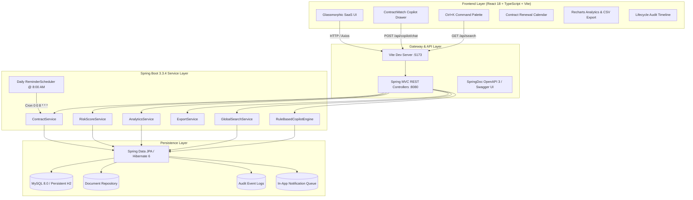

<div align="center">

# 🛡️ ContractWatch
### **“Never Miss a Renewal.”**
#### Enterprise Contract Renewal Management System & AI Copilot

[](https://adoptium.net/)
[](https://spring.io/projects/spring-boot)
[](https://react.dev/)
[](https://www.typescriptlang.org/)
[](https://www.mysql.com/)
[](https://vitejs.dev/)
[](https://tailwindcss.com/)
[](http://localhost:8080/swagger-ui.html)
[](LICENSE)

<br/>

> **"Never miss a critical renewal deadline or auto-renew forgotten SaaS subscriptions again."**  
> ContractWatch is an enterprise-grade contract renewal intelligence platform that tracks vendors, contracts, notice windows, expiry horizons, document repositories, renewal decisions, audit trails, and portfolio risks with an intelligent **ContractWatch AI Copilot**.

<br/>

[Quick Start](#-quick-start) • [Architecture](#-system-architecture) • [Core Capabilities](#-core-capabilities) • [Risk Score Engine](#-dynamic-contract-risk-engine) • [AI Copilot](#-contractwatch-ai-copilot) • [Calendar & Analytics](#-calendar--analytics) • [API Documentation](#-api-documentation) • [Testing](#-testing--quality-assurance)

---

</div>

## 📌 Executive Summary

Modern organizations manage hundreds of software licenses, infrastructure agreements, real-estate leases, and vendor retainers. Lapsed notice periods trigger automatic unwanted renewals, penalties, or critical service shutdowns.

**ContractWatch** provides proactive contract governance:
- 🕒 **Automated Review Dates**: Dynamically calculates `renewalReviewDate = endDate - renewalNoticeDays` and triggers stage transitions.
- ⚡ **Strict Contract Lifecycle**: Enforces valid status progressions across `ACTIVE` → `RENEWAL_DUE` → `RENEWED` / `TERMINATED` / `EXPIRED`.
- 🛡️ **Dynamic Contract Risk Scoring (0–100)**: Evaluates days remaining, notice period status, missing attachments, and contract value to flag `CRITICAL`, `HIGH`, `MEDIUM`, or `LOW` risk.
- 🤖 **ContractWatch AI Copilot**: Context-aware natural-language assistant backed by real database data that answers complex contract queries without requiring external API keys.
- 📅 **Interactive Contract Calendar**: Switch between Month and Agenda list views to track upcoming reviews and expirations.
- 📈 **Executive Analytics (Recharts)**: Visualizes status distribution, monthly expiry forecasts, vendor commitments, and risk tiers with live CSV report export.
- 📁 **Centralized Document Hub**: Multi-document repository supporting MSAs, amendments, invoices, SOC2 compliance, and versioning.
- 📜 **Full Audit Timeline (`<AuditTimeline />`)**: Trace every contract event (`CONTRACT_CREATED`, `DOCUMENT_ADDED`, `RENEWAL_WINDOW_STARTED`, `RENEWED`, `TERMINATED`).
- 🔎 **Global Command Palette (`Ctrl + K`)**: Instant search across contracts, vendors, and documents.

---

## 🏛️ System Architecture



---

## 🛡️ Dynamic Contract Risk Engine

ContractWatch features a non-hardcoded, multi-factor risk scoring engine (`RiskScoreService.java`):

$$\text{Risk Score} \in [0, 100]$$

| Score Range | Risk Level | Description |
|---|---|---|
| **81 – 100** | <span style="color:#f43f5e;font-weight:bold;">CRITICAL</span> | Immediate threat: Expires in $\le 7$ days without renewal, or expired active obligation |
| **61 – 80** | <span style="color:#f59e0b;font-weight:bold;">HIGH</span> | Urgent attention: Expires in $\le 15$ days, renewal notice overdue, or high-value without docs |
| **31 – 60** | <span style="color:#3b82f6;font-weight:bold;">MEDIUM</span> | Attention required: Inside review window (16–30 days) or missing documentation |
| **0 – 30** | <span style="color:#10b981;font-weight:bold;">LOW</span> | Nominal state: Healthy runway (>30 days), full documentation, active vendor contacts |

### Real-Time Factors Evaluated:
1. **Expiry Horizon**: Points scaled by days remaining until contract termination.
2. **Renewal Review Window**: Checks if current date has passed `renewalReviewDate`.
3. **Missing Documentation**: Penalizes contracts that have zero attached references or MSAs.
4. **Vendor Contact Gaps**: Verifies email, phone, and primary representative details.
5. **Contract Value Exposure**: Elevated weighting for commitments exceeding ₹5,00,000 / $50,000.
6. **Prior Renewal Velocity**: Checks if earlier renewal attempts were stalled.

---

## 🤖 ContractWatch AI Copilot

Floating bottom-right drawer delivering database-backed conversational insights. Supports interactive demo query cards and natural language understanding:

### Pre-loaded Demo Questions:
- *"Which contracts expire in the next 30 days?"*
- *"What should I review today?"*
- *"Show high risk contracts"*
- *"Give me today's contract priorities"*
- *"Show contracts worth more than ₹5 lakh"*
- *"Which vendor has the most contracts?"*
- *"Summarize my renewal risks"*
- *"Show renewal due contracts"*

Each Copilot response includes interactive action cards enabling immediate navigation to **View Contract**, **Renew**, or **Terminate**.

---

## 📅 Calendar & Analytics

### 1. Contract Calendar (`/calendar`)
- **Month View**: Grid calendar highlighting renewal review start dates (amber) and expiration dates (red/critical).
- **Agenda View**: Chronological milestone list with quick-jump action triggers.
- **Interactive Details**: Clicking any milestone pops up contract terms and days countdown.

### 2. Executive Analytics (`/analytics`)
- **Status Distribution**: Pie and progress breakdown of Active, Renewal Due, Renewed, Terminated, and Expired contracts.
- **12-Month Expiry Forecast**: Bar chart showing monthly expiration horizon and capital at risk.
- **Vendor Exposure Share**: Visual ranking of total financial commitment per vendor.
- **Risk Tier Distribution**: Portfolio breakdown across Low, Medium, High, and Critical risk tiers.
- **Live CSV Export**: Instant one-click exports for Contract Register, Renewal Due Report, and High-Risk Analysis.

---

## 📁 Multi-Document Repository (`/documents`)

- Stores multiple document attachments per contract:
  - `CONTRACT` (Master Service Agreements)
  - `INVOICE` (Commercial billing receipts)
  - `AGREEMENT` (Non-disclosure & SLA terms)
  - `AMENDMENT` (Addenda & scope alterations)
  - `COMPLIANCE` (SOC2, ISO27001, GDPR certificates)
  - `OTHER` (Procurement notes)
- Supports semantic versions (e.g. `v1.0`, `v2.1`), cloud URL references, upload timestamps, and uploader identity.

---

## 📜 Contract Lifecycle Audit Timeline (`<AuditTimeline />`)

Every operational lifecycle event writes a durable, tamper-evident audit log:
```
CONTRACT_CREATED ──> DOCUMENT_ADDED ──> RENEWAL_WINDOW_STARTED ──> RENEWAL_REVIEWED ──> CONTRACT_RENEWED / TERMINATED
```

---

## 🗄️ Database & Entities Overview

ContractWatch uses a normalized relational database with the following core entities:
- **`Vendor`**: Stores company details, contact person, and aggregated risk.
- **`Contract`**: The central entity (linked to Vendor). Tracks `startDate`, `endDate`, `renewalNoticeDays`, and computed `renewalReviewDate`.
- **`Document`**: Polymorphic attachment entity for MSAs, Invoices, and Compliance docs.
- **`RenewalDecision`**: Audit record of when a contract was extended and by whom.
- **`AuditEvent`**: Append-only log for compliance tracing.
- **`Notification`**: System alerts for approaching deadlines.
- **`User`**: Security principals (Admin, Manager, Viewer).

---

## 🏗️ Project Structure

```text
contractwatch/
├── backend/                  # Spring Boot 3 + Java 21 REST API
│   ├── src/main/java/...     # Controllers, Services, Repositories, Entities
│   ├── src/main/resources/   # application.properties, schema.sql
│   └── pom.xml               # Maven configuration
├── frontend/                 # React 18 + Vite + TypeScript Client
│   ├── src/components/       # UI Components (Copilot, Command Palette)
│   ├── src/pages/            # Dashboard, Contracts, Vendors Views
│   ├── src/services/         # Axios API clients
│   └── tailwind.config.js    # Tailwind styling system
├── database/                 # SQL schemas and seed data
└── README.md                 # Project Documentation
```

---

## ⚙️ Demo Workflow

To experience the full power of ContractWatch:
1. **Login**: Use `admin@contractwatch.io` / `admin123`.
2. **Dashboard**: Observe the executive summary widgets and the 12-Month Expiry Forecast.
3. **Add Vendor**: Create a new vendor in the Vendors tab.
4. **Create Contract**: Link a contract to the vendor. Set an end date 40 days from now, and a 30-day notice period.
5. **View Risk**: Notice the risk engine automatically categorizes it based on the review window.
6. **Copilot**: Open the bottom-right AI Copilot and type: *"Which contracts expire in the next 30 days?"*
7. **Renew**: Go to the contract details, attach a mock PDF document, and hit **Renew** to extend the end date.
8. **Audit Trail**: Check the contract's audit timeline to see the cryptographic-style log of your actions.

---

## 🚧 Limitations

- **Email Integration**: Currently, notifications are in-app only. SMTP email delivery for renewals is mocked.
- **SSO**: Enterprise Single Sign-On (SAML/OIDC) is planned but not implemented in this version.
- **Storage**: Documents are currently stored in a local/mock repository, not an S3 bucket.

---

## 🗺️ Future Roadmap

- [ ] **AI-Powered Contract Extraction**: Use OCR and LLMs to automatically extract end dates and notice periods from uploaded PDF MSAs.
- [ ] **Slack/Teams Integration**: Push critical renewal alerts directly to corporate messaging channels.
- [ ] **Role-Based Access Control (RBAC)**: Granular permissions for department-level contract visibility (e.g., HR sees only HR contracts).
- [ ] **Multi-Currency Support**: Dynamic FX conversion for global portfolio valuation.

---

## 🌐 API Documentation

Every REST endpoint is documented with OpenAPI 3.0 annotations and accessible via **[http://localhost:8080/swagger-ui.html](http://localhost:8080/swagger-ui.html)**.

| Category | Method | Path | Description |
|---|---|---|---|
| **Vendors** | `GET` | `/api/vendors` | List all registered vendors |
| | `POST` | `/api/vendors` | Register a new vendor |
| | `GET` | `/api/vendors/{id}` | Get vendor profile with contract statistics |
| **Contracts** | `GET` | `/api/contracts` | List all contracts with dynamic risk scores |
| | `POST` | `/api/contracts` | Create contract & enforce notice calculations |
| | `GET` | `/api/contracts/{id}` | Get contract details, dates, and risk factors |
| | `PUT` | `/api/contracts/{id}` | Update contract parameters |
| | `DELETE` | `/api/contracts/{id}` | Delete contract and associated audit trail |
| | `GET` | `/api/contracts/active` | Filter active contracts |
| | `GET` | `/api/contracts/renewal-due` | Filter contracts in renewal review window |
| | `GET` | `/api/contracts/expiring?days=30` | Contracts expiring within $N$ days |
| **Renewal** | `POST` | `/api/contracts/{id}/renew` | Renew contract, extend date, record decision |
| | `POST` | `/api/contracts/{id}/terminate` | Terminate contract and remove from alerts |
| | `GET` | `/api/contracts/{id}/decisions`| Retrieve formal renewal decision history |
| **Documents** | `GET` | `/api/documents` | Retrieve all documents across contracts |
| | `GET` | `/api/contracts/{id}/documents` | Retrieve documents for a specific contract |
| | `POST` | `/api/contracts/{id}/documents`| Attach document reference to contract |
| | `DELETE` | `/api/documents/{id}` | Remove a document reference |
| **Audit** | `GET` | `/api/contracts/{id}/audit` | Retrieve complete audit event timeline |
| **Search** | `GET` | `/api/search?q={query}` | Global search across contracts, vendors, docs |
| **Analytics** | `GET` | `/api/analytics/status` | Contract status counts and valuations |
| | `GET` | `/api/analytics/expiry` | Monthly expiry forecast |
| | `GET` | `/api/analytics/vendors` | Vendor commitment breakdown |
| | `GET` | `/api/analytics/risk` | Portfolio risk score distribution |
| | `GET` | `/api/analytics/metrics` | Executive portfolio KPIs |
| **Export** | `GET` | `/api/export/contracts` | Download CSV Contract Register |
| | `GET` | `/api/export/renewals` | Download CSV Renewal Report |
| | `GET` | `/api/export/risks` | Download CSV High-Risk Report |
| **Copilot** | `POST` | `/api/copilot/chat` | AI query processing & intent detection |
| **Notifications** | `GET` | `/api/notifications` | List user notification queue |
| | `PUT` | `/api/notifications/{id}/read` | Mark individual notification read |
| | `PUT` | `/api/notifications/read-all` | Mark all notifications read |

---

## 🚀 Quick Start

### Prerequisites
- **Java 21+** ([Eclipse Adoptium Temurin](https://adoptium.net/))
- **Node.js 18+ & npm**
- **Maven 3.9+** (or use the built-in launcher)

---

### 🟢 One-Click Windows Launch

Run the provided script in the root directory:
```cmd
run-all.bat
```
This automatically boots:
1. **Spring Boot Backend**: [http://localhost:8080](http://localhost:8080)
2. **React Frontend**: [http://localhost:5173](http://localhost:5173)

---

### 💻 Manual Startup

#### 1. Backend Service
```powershell
cd backend
$env:JAVA_HOME = "C:\Program Files\Eclipse Adoptium\jdk-21.0.12.101-hotspot"
$env:PATH = "$env:JAVA_HOME\bin;$env:PATH"

# Run with Maven:
mvn clean spring-boot:run

# Or run the packaged executable JAR:
java -jar target/contractwatch-backend-1.0.0.jar
```

#### 2. Frontend Application
```bash
cd frontend
npm install
npm run dev
```

Open **[http://localhost:5173](http://localhost:5173)** in your browser!

---

## 🧪 Testing & Quality Assurance

### Run Backend Unit Tests:
```powershell
cd backend
mvn test
```
**Test Coverage Includes:**
- Contract creation & validation rules
- Invalid date progression rejection (`endDate <= startDate`)
- Negative and excessive notice period validation
- Duplicate contract number uniqueness
- Dynamic `renewalReviewDate` calculation
- Renewal due status transitions
- Contract renewal (`newEndDate > endDate`) & decision logging
- Contract termination exclusion from active reminder queues
- Dynamic risk score engine calculations

---

## 📄 License
This project is open-source under the [MIT License](LICENSE).
