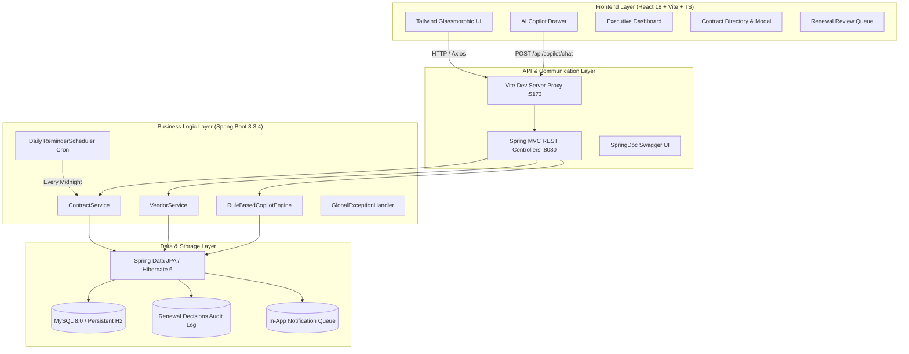
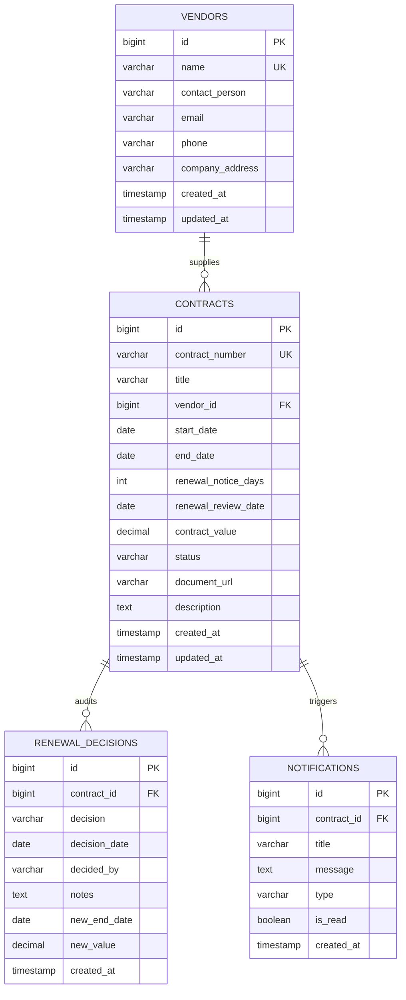

<div align="center">

# 🛡️ ContractWatch
### **Enterprise Contract Renewal Reminder Tracker & AI Copilot**

[](https://adoptium.net/)
[](https://spring.io/projects/spring-boot)
[](https://react.dev/)
[](https://www.typescriptlang.org/)
[](https://www.mysql.com/)
[](https://vitejs.dev/)
[](https://tailwindcss.com/)
[](http://localhost:8080/swagger-ui.html)
[](LICENSE)

<br/>

> **"Never miss a critical renewal deadline again."**  
> ContractWatch is a production-grade full-stack contract management platform designed to automate renewal lifecycles, eliminate vendor lock-in lapses, enforce strict enterprise governance, and deliver contextual decision intelligence powered by the **ContractWatch AI Copilot**.

<br/>

[Quick Start](#-quick-start) • [Architecture](#-system-architecture) • [Key Features](#-key-features) • [Database Design](#-database-design--er-diagram) • [API Documentation](#-api-documentation) • [AI Copilot](#-ai-copilot-engine) • [Testing](#-testing--quality-assurance)

---

</div>

## 📌 Executive Summary

Modern enterprises leak millions annually due to auto-renewing forgotten SaaS subscriptions, missing renegotiation notice windows, or struggling with decentralized contract spreadsheets. 

**ContractWatch** solves this end-to-end:
- 🕒 **Automated Renewal Windows**: Automatically calculates `renewalReviewDate = endDate - renewalNoticeDays` and triggers alerts before deadlines.
- ⚡ **Automated Status Lifecycle**: Contracts transition dynamically through `ACTIVE` → `RENEWAL_DUE` → `RENEWED` / `TERMINATED` / `EXPIRED`.
- 🤖 **ContractWatch AI Copilot**: In-app conversational assistant that extracts contract expirations, evaluates portfolio risks, and highlights urgent renewal decisions.
- 📊 **Executive Command Center**: Interactive metrics for active commitments, high-urgency timelines, status distributions, and vendor exposure.
- 🔒 **Enterprise Business Rules**: Prevents renewals of terminated contracts, enforces forward date progression, and prevents duplicate identifiers.

---

## 🏛️ System Architecture



---

## 💎 Key Features

### 1. 📋 Contract Lifecycle Engine
- **Full Lifecycle Auditing**: Manage contracts across states: `ACTIVE`, `RENEWAL_DUE`, `RENEWED`, `TERMINATED`, `EXPIRED`.
- **Automated Review Calculation**: The system automatically enforces `renewalReviewDate = endDate - renewalNoticeDays`.
- **Document Hub**: Attach direct links to cloud-hosted contracts, MSAs, and SOWs (Google Drive, OneDrive, S3, DocuSign).
- **Renewal Audit Trail**: Every renewal or termination decision records the user, timestamps, negotiated amounts, and rationale.

### 2. ⚡ Renewal Command Center
- **Urgency Matrix**: Classifies contracts into:
  - 🔴 **Critical**: Expiration within $\le 15$ days
  - 🟠 **High**: Expiration within $16 - 30$ days
  - 🟡 **Medium**: Review notice period currently active
- **One-Click Renewal**: Extends validity, records negotiated value changes, and captures review notes.
- **Controlled Termination**: Explicitly terminates services with justification, instantly purging them from future renewal queues.

### 3. 🤖 ContractWatch AI Copilot
The AI Copilot is an embedded assistant with natural language intent recognition:
- **Instant Expiration Forecast**: *"Which contracts expire in the next 30 days?"*
- **Portfolio Risk Assessment**: *"Summarize my renewal risks and urgent items"*
- **Vendor Concentration Analytics**: *"Which vendor has the highest contract volume?"*
- **Actionable Advice**: Returns formatted response cards, live contract references, and urgency flags.

### 4. ⏰ Automated Cron Scheduler
- Runs daily background jobs (`@Scheduled(cron = "0 0 0 * * *")`):
  1. Identifies contracts reaching `renewalReviewDate` and updates status to `RENEWAL_DUE`.
  2. Dispatches in-app notifications to prevent missed notice deadlines.
  3. Transitions passed contracts to `EXPIRED` if no action was taken.

---

## 🗄️ Database Design & ER Diagram

The database structure is designed for high relational integrity, normalized vendor data, and full audit traceability:



### Advanced SQL Assessment Scripts (`database/`)
- [`schema.sql`](database/schema.sql) — Complete MySQL 8.0 DDL with relational constraints, indices, checks, and foreign keys.
- [`seed_data.sql`](database/seed_data.sql) — Realistic enterprise mock data (AWS, Microsoft, Google Cloud, Salesforce, CrowdStrike, etc.).
- [`analytical_queries.sql`](database/analytical_queries.sql) — 8 advanced queries showcasing:
  - Multi-table JOINs and urgency classification
  - Total financial exposure by vendor
  - Window functions (`DENSE_RANK()`, `ROW_NUMBER()`)
  - Common Table Expressions (CTEs) for latest decision tracking
  - 12-month forward expiration forecasting

---

## 🚀 Quick Start

### Prerequisites
- **Java 21+** ([Eclipse Adoptium Temurin](https://adoptium.net/))
- **Node.js 18+ & npm**
- **Maven 3.9+** (or use the built-in batch launcher)
- *Optional*: MySQL 8.0+ (ContractWatch includes a zero-configuration persistent local database out-of-the-box)

---

### 🟢 One-Click Launch (Windows)

Simply double-click:
```cmd
run-all.bat
```
This automatically launches:
1. **Backend Server** on [http://localhost:8080](http://localhost:8080)
2. **Frontend UI** on [http://localhost:5173](http://localhost:5173)

---

### 💻 Manual Startup

#### 1. Backend Service
```powershell
cd backend
$env:JAVA_HOME = "C:\Program Files\Eclipse Adoptium\jdk-21.0.12.101-hotspot"
$env:PATH = "$env:JAVA_HOME\bin;$env:PATH"

# Run with Maven
mvn spring-boot:run

# Or run the packaged executable JAR directly:
java -jar target/contractwatch-backend-1.0.0.jar
```

#### 2. Frontend Application
```bash
cd frontend
npm install
npm run dev
```

Visit **[http://localhost:5173](http://localhost:5173)** in your browser!

---

## 🌐 Application Endpoints

| Portal | URL | Description |
|---|---|---|
| **🎨 Web Application** | `http://localhost:5173` | React Dashboard, Contracts & Copilot UI |
| **📑 Interactive Swagger UI** | `http://localhost:8080/swagger-ui.html` | Live OpenAPI 3.0 API explorer |
| **🔍 Raw OpenAPI Specification** | `http://localhost:8080/api-docs` | Full JSON API specification |
| **🗄️ Database Console** | `http://localhost:8080/h2-console` | In-browser DB (`jdbc:h2:file:./data/contractwatch`, User: `sa`) |

---

## 🔌 API Documentation

### Dashboard
| Method | Endpoint | Description |
|---|---|---|
| `GET` | `/api/dashboard/summary` | Portfolio counters, status breakdown, and urgent counts |

### Contracts
| Method | Endpoint | Description |
|---|---|---|
| `GET` | `/api/contracts` | List all contracts (supports vendor & status filters) |
| `GET` | `/api/contracts/{id}` | Get full contract profile and renewal history |
| `POST` | `/api/contracts` | Create contract with validation and date calculation |
| `PUT` | `/api/contracts/{id}` | Update contract details |
| `DELETE` | `/api/contracts/{id}` | Remove contract |
| `GET` | `/api/contracts/renewal-due` | Contracts within the notice period |
| `GET` | `/api/contracts/expiring?days=30` | Contracts expiring within N days |
| `POST` | `/api/contracts/{id}/renew` | Renew contract with new end date and negotiated value |
| `POST` | `/api/contracts/{id}/terminate` | Terminate contract with audit reason |
| `POST` | `/api/contracts/{id}/document-reference`| Attach link to cloud-hosted contract document |

### Vendors
| Method | Endpoint | Description |
|---|---|---|
| `GET` | `/api/vendors` | List all vendors with active contract counts |
| `POST` | `/api/vendors` | Register new vendor |
| `GET` | `/api/vendors/{id}` | Vendor details and full associated contracts list |

### AI Copilot & Notifications
| Method | Endpoint | Description |
|---|---|---|
| `POST` | `/api/copilot/chat` | Natural language queries to the ContractWatch AI Engine |
| `GET` | `/api/notifications` | List all system notifications |
| `PUT` | `/api/notifications/{id}/read`| Mark single notification as read |
| `PUT` | `/api/notifications/read-all` | Mark all notifications as read |

---

## 🤖 AI Copilot Engine

The AI Copilot architecture uses the extensible `CopilotEngine` interface with built-in intent classification:

```json
// Sample Request: POST /api/copilot/chat
{
  "message": "Which contracts are expiring in the next 30 days?"
}

// Sample Response:
{
  "message": "Found **4 contract(s)** expiring within the next 30 days. I recommend reviewing these immediately.",
  "intent": "EXPIRING_CONTRACTS",
  "data": [
    {
      "contractNumber": "CW-2026-002",
      "title": "Microsoft 365 Enterprise License",
      "vendorName": "Microsoft Corporation",
      "daysUntilExpiry": 8,
      "status": "RENEWAL_DUE"
    }
  ],
  "insight": {
    "severity": "HIGH_RISK",
    "title": "🔴 High Expiry Risk",
    "description": "4 contracts expiring in 30 days require immediate attention."
  }
}
```

---

## 🧪 Testing & Quality Assurance

Comprehensive unit test suite powered by **JUnit 5** and **Mockito**:

```powershell
cd backend
mvn test -Dspring.profiles.active=test
```

**Verified Test Cases:**
- `shouldCreateContract_WithValidData`: Confirms automatic calculation of `renewalReviewDate`.
- `shouldThrowException_WhenStartDateAfterEndDate`: Guards against invalid chronological ranges.
- `shouldThrowException_WhenNoticeDaysExceedDuration`: Guards against illogical notice periods.
- `shouldThrowException_WhenDuplicateContractNumber`: Prevents unique constraint collisions.
- `shouldRenewContract_WithValidNewEndDate`: Validates renewal logic and forward date enforcement.
- `shouldThrowException_WhenRenewingTerminatedContract`: Enforces terminal contract immutability.
- `shouldTerminateContract`: Verifies status transitions and audit log generation.
- `shouldNotIncludeTerminatedContracts_InRenewalDueList`: Enforces status filtering guards.

---

## 👨‍💻 Tech Stack Summary

- **Backend**: Spring Boot 3.3.4, Java 21, Spring Data JPA, Hibernate 6, Lombok, SpringDoc OpenAPI.
- **Frontend**: React 18, TypeScript, Vite, Tailwind CSS, Lucide Icons, Recharts, React Hot Toast.
- **Database**: MySQL 8.0+ / H2 Zero-Config Embedded Engine.
- **Tooling**: Maven 3.9+, Git, Postman, Visual Studio Code.

---

## 📄 License

This project is licensed under the **MIT License** — feel free to use, modify, and distribute for academic, personal, or commercial evaluation.
